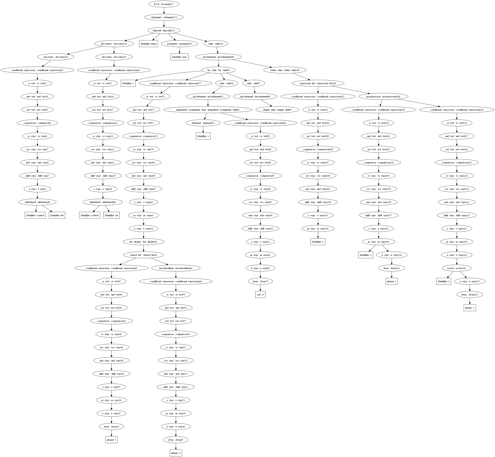

# This is main Heading

## This is sub-main Heading

### This is sub-sub-main Heading

New Paragraph
Same Paragraph

Other New Paragraph

Or you can add two Spaces  
to new line  
But, it Same Paragraph

this is **Bold** Text  
this is *italic* Text  
this is ***Bold & italic*** Text

this is ~~crossed off~~

this is <mark>highlighted</mark>

H<sub>2</sub>O

😂

```php
var_dump('ffff')
    $r = 0
```

Click on [Link](https://google.com)  
Another way :  
Click on [Link][def]

[def]: https://google.com
---
<https://google.com>

this is image 

>Block Quote
>>sub-block quote
